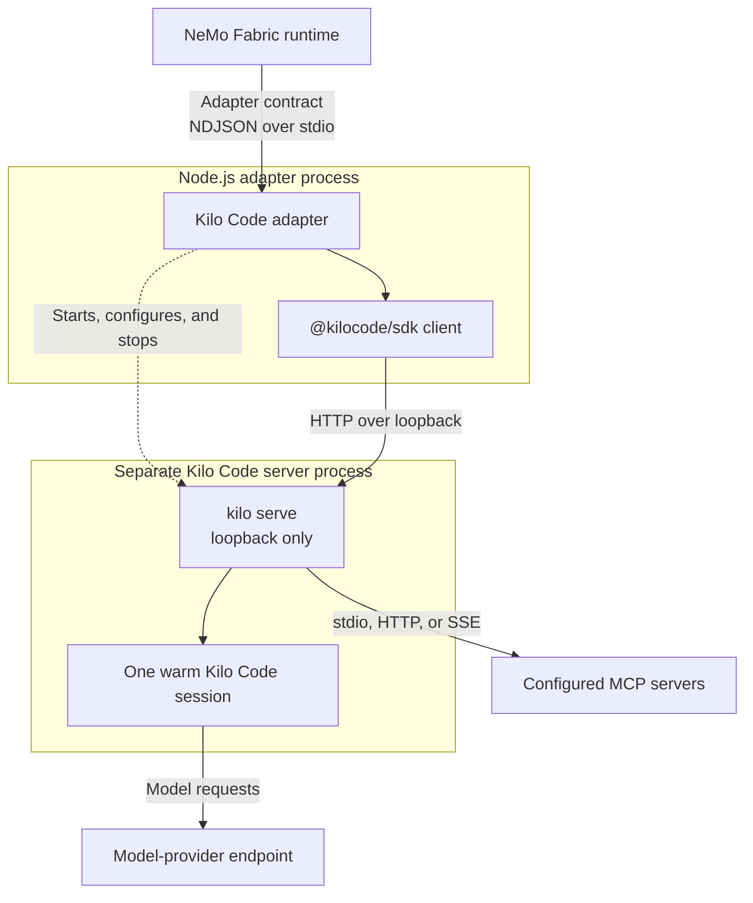

{/* SPDX-FileCopyrightText: Copyright (c) 2026, NVIDIA CORPORATION & AFFILIATES. All rights reserved.
SPDX-License-Identifier: Apache-2.0 */}

Use the `nvidia.fabric.kilo` adapter to run tasks with Kilo Code. Each NVIDIA
NeMo Fabric runtime starts one isolated `kilo serve` child process and reuses
one Kilo Code session across ordered invocations. Kilo Code runs as a separate
server process; it is not embedded in the adapter process.

## Install the Adapter

Install Node.js 22.19 or later. Then install the adapter and its exact-pinned,
consumer-managed Kilo Code packages in the project that owns the NeMo Fabric
configuration:

```bash
npm install --save-exact nemo-fabric-adapters-kilo @kilocode/cli@7.7.12 @kilocode/sdk@7.7.12
```

The Kilo CLI and SDK are optional peers. Installing the adapter alone does not
install them. Starting the adapter without the compatible packages returns
`kilo_harness_unavailable`.

For source development, run these commands from the repository root:

```bash
just install-typescript-kilo
npm install --prefix adapters/typescript --no-save --package-lock=false @kilocode/cli@7.7.12
npm run build --prefix adapter-contract/typescript
npm run build --prefix adapters/typescript --workspace nemo-fabric-adapters-common
npm run build --prefix adapters/typescript --workspace nemo-fabric-adapters-kilo
```

## Configure the Adapter

Select the Kilo Code integration and point discovery at the installed adapter
descriptor:

```python
from nemo_fabric import DiscoveryConfig, FabricConfig, HarnessConfig
from nemo_fabric import MetadataConfig, ModelConfig

config = FabricConfig(
    metadata=MetadataConfig(name="kilo-review"),
    discovery=DiscoveryConfig(
        local_paths=[
            "./node_modules/nemo-fabric-adapters-kilo/kilo.fabric-adapter.json"
        ]
    ),
    harness=HarnessConfig(adapter_id="nvidia.fabric.kilo"),
    models={
        "default": ModelConfig(
            provider="nvidia",
            model="nvidia/nemotron-3-nano-30b-a3b",
            api_key_env="NVIDIA_API_KEY",
            base_url="https://integrate.api.nvidia.com/v1",
        )
    },
)
```

Set `NVIDIA_API_KEY` before starting the runtime. For a source build, set
`discovery.local_paths` to
`adapters/typescript/kilo/kilo.fabric-adapter.json` instead. The build commands
above create the descriptor's `dist/cli.js` runner.

## Supported Configuration

The adapter supports the following normalized configuration:

- **Models:** Selects the `default` role, or the only configured role. It maps
  `provider`, `model`, `api_key_env`, `base_url`, `temperature`, and `top_p`.
- **Instructions:** Supports `instructions.system` with `mode: replace`.
- **Runtime:** Maps a positive `runtime.max_turns` to Kilo Code's build-agent
  step limit.
- **Tools:** Maps native Kilo Code tool names in `tools.enabled` and
  `tools.blocked`. Tool definitions are unsupported.
- **Skills:** Each `skills.paths` entry must be a directory containing
  `SKILL.md`. Startup verifies that Kilo Code loaded every configured skill.
- **MCP:** Supports stdio, streamable HTTP, and SSE server configurations.
  Startup requires every configured server to report `connected`.

### Model Endpoints

When `base_url` is set, it must identify an OpenAI-compatible model-provider
endpoint. It is not the address of the Kilo Code server. Without `base_url`,
the configured provider and model must be supported by Kilo Code. HTTPS is
required except for loopback HTTP. For a trusted private IPv4 HTTP endpoint,
explicitly set `harness.settings.allow_insecure_http_model_endpoint` to `true`.
Public IP addresses, hostnames, and link-local addresses remain blocked. The
model credential and prompt content are then sent over an unencrypted connection.

### MCP Configuration

Remote MCP endpoints require HTTPS except for loopback development endpoints.
They may define headers but not process arguments or environment variables.
Stdio servers may define arguments and environment variables but not headers.

Header values may reference `${NAME}`. Resolution checks NeMo Fabric
`environment.env` first and then the parent process environment. Unresolved
references fail startup. Normalized MCP authentication and per-server tool
filters are unsupported.

### Runtime Behavior

The adapter accepts plain-text input and returns the terminal assistant text in
`output.response`. Usage and cost are included when Kilo Code reports them.
Ordered invocations reuse one warm session and its conversation history. A
prompt has a 30-minute deadline; on timeout the adapter asks Kilo Code to abort
the prompt and reports `kilo_prompt_timeout`.

The adapter disables project Kilo Code configuration and uses temporary Kilo
and XDG directories. The child process receives required operating-system
variables, explicit NeMo Fabric `environment.env` values, and the selected model
credential. Other parent variables are not forwarded.

The adapter is non-interactive. It denies follow-up questions, access outside
the workspace, doom-loop continuation, and direct reads of `.env` files. These
permission rules are not a filesystem sandbox and cannot prevent an enabled
shell tool from reading workspace files. Use an environment provider when the
task needs stronger isolation.

`models.max_tokens`, provider-specific model settings, append-mode system
instructions, streaming, cancellation, service mode, and Relay telemetry are
unsupported.

## Understand the Runtime Lifecycle

The adapter runs as a persistent Node.js process, but the Kilo Code harness does
not run in-process. `start` launches `kilo serve` as a separate child process on
an available loopback port, connects through `@kilocode/sdk`, and creates one
session. `stop` deletes the session, terminates that server, and removes its
temporary profile.



Create a new runtime to change the selected model, workspace, skills, MCP
servers, or tool policy.
